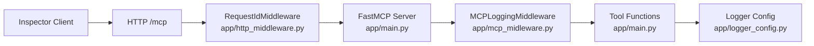
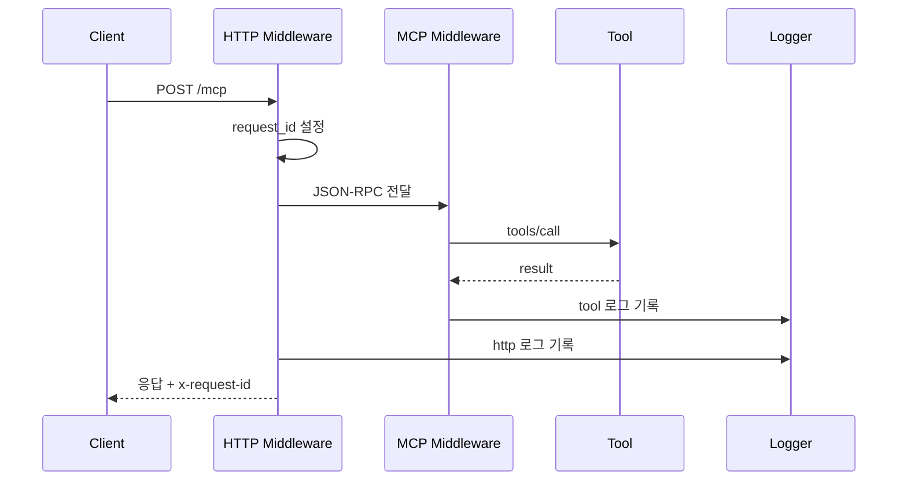

# DIAGRAM_GUIDE.md

## 아키텍처 다이어그램

설명:
- HTTP 요청은 먼저 `RequestIdMiddleware`를 통과하며 request_id가 설정됩니다.
- FastMCP가 JSON-RPC 요청을 도구 호출로 라우팅합니다.
- MCP 도구 호출 전후는 `MCPLoggingMiddleware`가 기록합니다.
- 최종 로그 포맷/필터는 `logger_config.py`에서 적용됩니다.
- 코드 경로: `app/main.py`, `app/http_middleware.py`, `app/mcp_midleware.py`, `app/logger_config.py`.

## 요청-로그 흐름 다이어그램

설명:
- HTTP와 MCP 로그를 분리하면 장애 원인 분석이 빨라집니다.
- 응답 헤더의 `x-request-id`로 클라이언트와 서버 로그를 연결합니다.
- tool 로그는 비즈니스 호출 단위, http 로그는 전송 단위 추적에 유리합니다.
- payload는 요약/마스킹 정책으로 기록합니다.
- 코드 경로: `app/http_middleware.py`, `app/mcp_midleware.py`.
